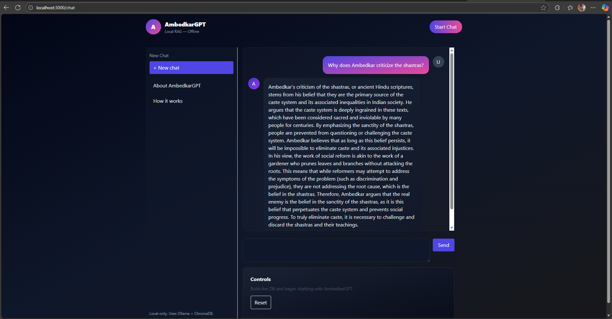
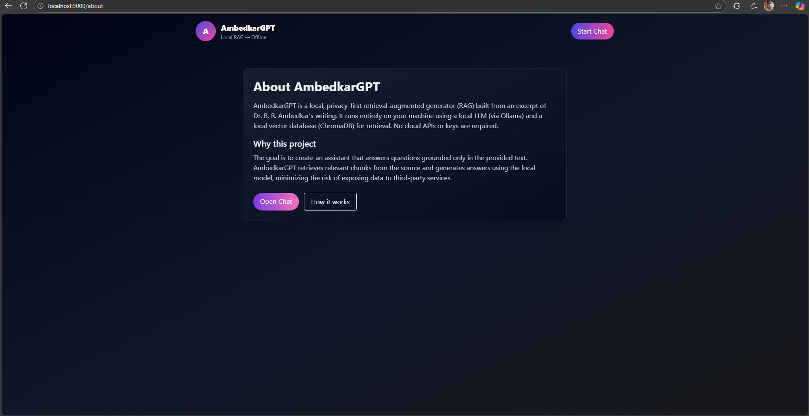
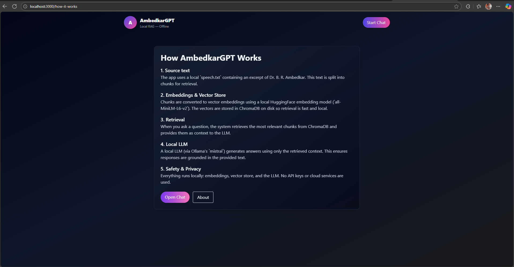

# AmbedkarGPT-Intern-Task

Local command-line RAG system using LangChain, ChromaDB, HuggingFace embeddings, and Ollama (mistral).

Requirements
- Python 3.11
- Ollama installed and running locally

Dependencies
Install the Python dependencies into your environment:

```powershell
python -m pip install -r requirements.txt
```

Ollama setup
1. Install Ollama following https://ollama.com/docs (ensure the `ollama` CLI is available).
2. Pull the required model locally:

```powershell
ollama pull mistral
```

Usage
1. Build embeddings and persist the Chroma database (run once or whenever `speech.txt` changes):

```powershell
python main.py --build
```

2. Start interactive Q&A mode:

```powershell
python main.py
```

# AmbedkarGPT

AmbedkarGPT is a local, privacy-first Retrieval-Augmented Generation (RAG) application built from an excerpt of Dr. B. R. Ambedkar's writing. The system runs entirely on your machine using local embeddings, a Chroma vector store, and Ollama for the language model — no cloud APIs or keys required.

Repository layout

- `backend/` — FastAPI backend that builds/serves the Chroma DB and exposes query endpoints
	- `main.py` — FastAPI app (endpoints: `/api/status`, `/api/build-db`, `/api/query`)
	- `rag.py` — RAG pipeline (text splitting, embeddings, Chroma persistence, RetrievalQA)
	- `speech.txt` — source text used to build the DB
	- `requirements.txt` — backend Python dependencies
- `frontend/` — Next.js (App Router) + Tailwind frontend
	- `app/` — pages and components (`/`, `/chat`, `/about`, `/how-it-works`)
	- `components/` — UI components (Navbar, Sidebar, ChatBubble, etc.)
	- `lib/api.tsx` — axios helpers to call backend endpoints


Quick setup (Windows PowerShell)

1) Backend (Python 3.11)

```powershell
cd backend
python -m venv .venv
.\.venv\Scripts\Activate.ps1
python -m pip install --upgrade pip
python -m pip install -r requirements.txt

# Pull Ollama model (requires Ollama installed separately)
ollama pull mistral

# Start the API server
uvicorn main:app --reload --host 0.0.0.0 --port 8000
```

Notes:
- The backend exposes these endpoints:
	- `GET /api/status` → JSON `{ "built": true|false }` — checks whether the Chroma DB exists
	- `POST /api/build-db` → builds the Chroma DB (used by frontend fallback)
	- `POST /api/query` → accepts `{ "question": "..." }` and returns `{ "answer": "...", "context": ["chunk1...", ...] }`

2) Frontend (Node.js)

```powershell
cd frontend
npm install
npm run dev
```

Open `http://localhost:3000` (frontend) and the frontend communicates with the backend at `http://localhost:8000` by default.


Behavior & features

- Automatic build: On first visit to the chat page the frontend checks `GET /api/status` and will automatically call `POST /api/build-db` if a vector DB is not present. No manual build is required.
- Typing animation: When you submit a question the UI shows an animated typing indicator while the backend processes the query; the final answer and the grounding source chunks are then displayed.
- Offline-first: Uses local HuggingFace embeddings (`sentence-transformers/all-MiniLM-L6-v2`), ChromaDB on disk, and Ollama (`mistral`) locally.


How to use

1. Start the backend and frontend as shown above.
2. Navigate to `http://localhost:3000/chat`.
3. The app will automatically prepare the vector DB if it is missing (you will see a build indicator on first run).
4. Ask questions in the chat input — answers are grounded in the provided `speech.txt` and the UI shows the source chunks used.


Troubleshooting

- If the frontend reports that the DB cannot be built or endpoints fail, open the backend server logs (the uvicorn console) to inspect errors.
- Ensure Ollama is installed and `ollama pull mistral` has finished before querying.
- If you changed dependency versions, reinstall dependencies in the respective `backend` and `frontend` folders.


Screenshots

Include screenshots in your repository at these paths and they will render here:

— Chat interface while answering
  

 — About AmbedkarGPT
   

 — How It Works?
   

You can add them via Git after running the app and taking screenshots.


Development notes

- Backend: RAG pipeline uses `RecursiveCharacterTextSplitter`, `HuggingFaceEmbeddings(all-MiniLM-L6-v2)`, `Chroma.from_documents()` to build, and `Chroma(persist_directory=...)` to load. RetrievalQA is created with `chain_type="stuff"` and `chain_type_kwargs={"prompt": custom_prompt}`.
- Frontend: Next.js App Router + Tailwind. The chat shows a typing placeholder while awaiting the backend response and replaces it with the final AI answer and context chunks.

License & privacy

- This project is intended for local experimentation. All data and model usage remain on your machine.
